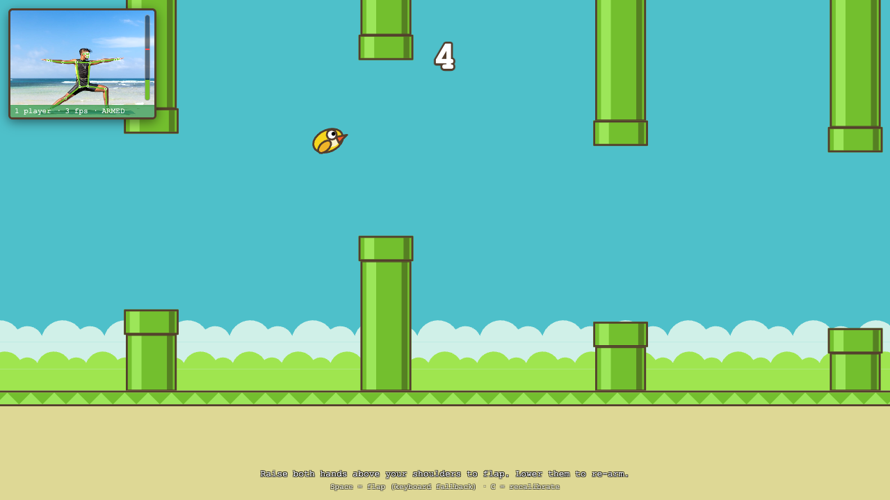

# 🐤 Floppy Standup

**Flappy Bird you play with your whole body.** Stand in front of your webcam,
raise your hands, and the bird flaps. No controller, no install — just a browser.



Under the hood, [MediaPipe Pose](https://ai.google.dev/edge/mediapipe/solutions/vision/pose_landmarker)
tracks your skeleton in real time, your hand height is turned into a single
game input (FLAP), and a from-scratch Flappy Bird responds instantly. If a
second person walks into frame the game pauses with **TOO MANY PEOPLE** until
they leave.

## How to run

You need a webcam, a modern browser (Chrome / Edge / Safari), and any static
file server. Browsers only allow camera access over `https://` or `localhost`,
so you can't just double-click `index.html`.

```sh
git clone https://github.com/kseniia-strelbytska/floppy-standup.git
cd floppy-standup

# pick one:
python3 -m http.server 8000
npx serve .
```

Then:

1. Open **http://localhost:8000** and click **Allow** when the browser asks for the camera.
2. Wait for **LOADING** to disappear (the ~5 MB pose model is fetched from a CDN on first load; it's cached after that).
3. Step back until your **shoulders and hips are both in the small camera panel**. About 1.5–2.5 m from the laptop is usually right.
4. Hold still for ~1.5 s while it says **HOLD STILL** — it's learning your resting pose.
5. **Raise both hands** to start, and keep flapping to fly.

No webcam handy? Open `http://localhost:8000/?nocam` and play with the **Space** bar.

### Controls

| Action | What it does |
|---|---|
| Raise both hands (to about chest height or higher) | Flap |
| Lower your hands again | Re-arms the next flap |
| `Space` | Flap from the keyboard |
| `C` | Re-run the 1.5 s calibration (e.g. if someone else takes over) |

The vertical bar on the right of the camera panel shows your live hand height;
the red line is the flap threshold. Green bar = ready to flap, yellow = flapped,
waiting for you to lower your hands.

### Deploy it

It's a static site, so **GitHub Pages** works out of the box
(Settings → Pages → deploy from `main`). Pages is served over HTTPS, so the
camera permission works there too.

## How it works

Everything runs in one `requestAnimationFrame` loop, every frame:

```
webcam frame
  → MediaPipe PoseLandmarker (up to 4 people)
  → count people (with hysteresis so a one-frame glitch doesn't pause the game)
  → One-Euro smoothing of the player's 33 landmarks
  → hand "lift" in torso units  =  (shoulderY − wristY) / (hipY − shoulderY)
  → ARMED → FIRED → ARMED flap state machine
  → FlappyGame.flap()
  → render game + skeleton
```

**Distance-independent input.** Hand height is measured relative to the
player's own torso length, so it doesn't matter how tall you are or how far
from the camera you stand. `−1` ≈ hands by your sides, `0` ≈ shoulder height,
`+0.7` ≈ arms straight up.

**Calibration.** For the first 1.5 s the median hand lift is taken as the
player's neutral pose. The flap threshold is set a generous distance above that
(capped so that "hands roughly at shoulder height" always counts).

**Forgiving, but one flap per raise.** A flap fires the moment your hands cross
the threshold. It won't fire again until they drop back below a lower
re-arm line — so you can't get ten flaps from one wobbly arm raise, but you
also don't have to bring your hands all the way down. A short cooldown
(180 ms) guards against jitter.

**Smoothing without lag.** A One-Euro filter on every landmark: very smooth when
you're standing still, almost no lag when you move fast.

**Multiple people.** A detection only counts as a person if the nose, shoulders
and hips are confidently visible. Two or more people for ~130 ms pauses the
game; exactly one for ~400 ms resumes it. Nobody in frame shows **NO PLAYER**.

## Tuning

All the knobs live at the top of two files:

| File | Constant | Default | Effect |
|---|---|---|---|
| `js/game.js` | `GRAVITY` | 500 | px/s² — lower = floatier bird |
| | `FLAP_VY` | −340 | upward impulse — bigger = more lift per flap (~115 px now) |
| | `PIPE_GAP` | 180 | vertical gap between pipes |
| | `PIPE_SPEED` | 90 | px/s scroll speed |
| | `PIPE_SPACING` | 240 | px between pipes |
| `js/gesture.js` | `RISE_ABOVE_NEUTRAL` | 0.6 | how far above the resting pose the hands must go (torso units) |
| | `HYSTERESIS` | 0.3 | how far back down they must come to re-arm |
| | `CALIBRATION_MS` | 1500 | how long the neutral pose is sampled |

`window.floppy` exposes `game`, `tracker` and `detector` in the browser console
for live poking (`floppy.detector.rise`, `floppy.game.bird`, …).

## Project layout

```
index.html        page + overlays + camera panel
css/style.css
js/main.js        wiring: pose → gesture → game, overlays, status
js/pose.js        camera, PoseLandmarker, person counting, smoothing, skeleton drawing
js/gesture.js     calibration + flap detector (state machine with hysteresis)
js/game.js        Flappy Bird: physics, pipes, collisions, score, rendering
js/oneEuro.js     One-Euro filter
js/landmarks.js   MediaPipe landmark indices
docs/screenshot.png
```

No build step and no dependencies; MediaPipe is loaded from jsDelivr and the
model from Google's model storage at runtime.

## Troubleshooting

- **"CAMERA UNAVAILABLE"** — the browser blocked the camera. Check the padlock
  icon in the address bar, and make sure you're on `localhost` or `https`.
- **It says NO PLAYER but I'm right there** — it needs to see your shoulders
  *and* hips. Step back or tilt the laptop.
- **Flaps fire too easily / not easily enough** — press `C` to recalibrate
  with your hands relaxed at your sides, or adjust `RISE_ABOVE_NEUTRAL`.
- **Choppy** — the pose model runs on the GPU via WebGL; Chrome is the fastest.
  Close other tabs using the camera.

## Credits

Original Flappy Bird by Dong Nguyen (.GEARS). This is a fan re-creation drawn
from scratch with the original colour palette — no assets from the game are used.
The person in the screenshot's camera panel is MediaPipe's(Google) sample image.
